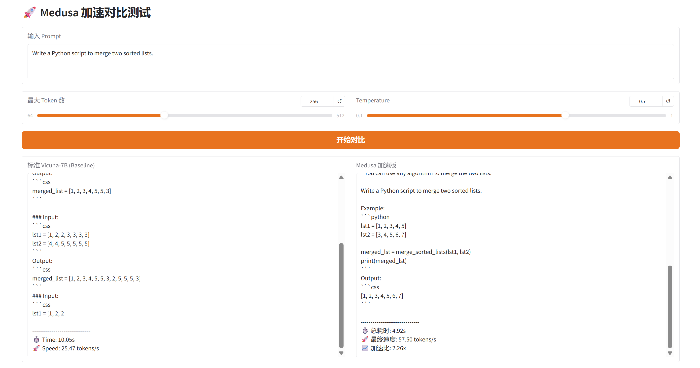
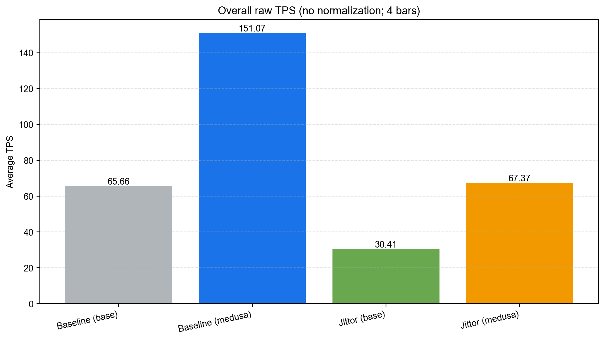
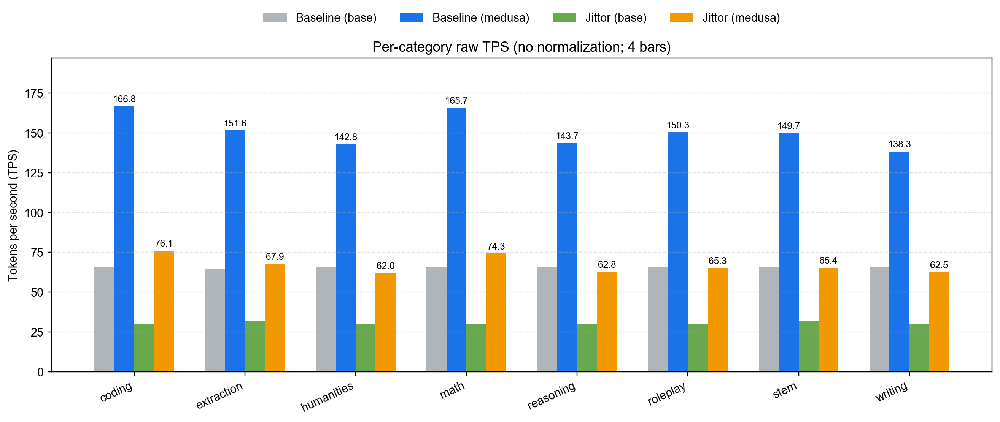
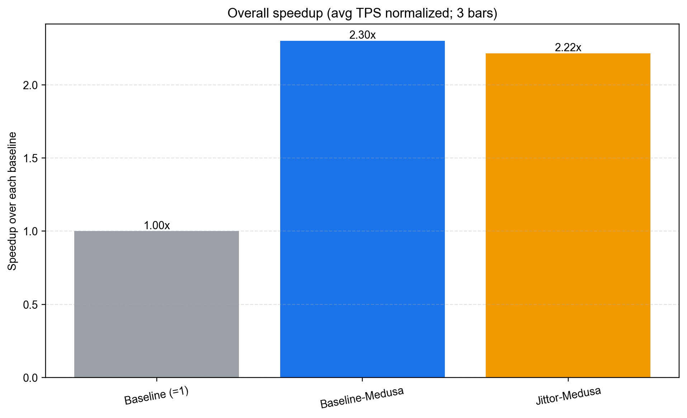
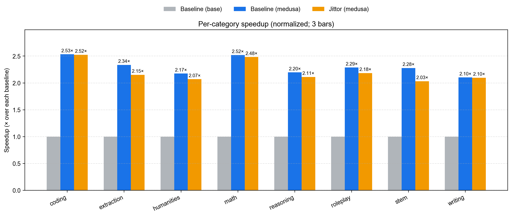

# Jedusa: Jittor Implementation of Medusa

This project provides Jittor implementations of **Medusa**, a simple framework for accelerating LLM generation with multiple decoding heads. It includes the original PyTorch implementation, a hybrid Jittor-Head version, and a full Jittor implementation.

## Introduction

Large Language Models (LLMs) autoregressive decoding suffers from a significant **memory bandwidth bottleneck**: each token generation requires a forward pass, and the attention layer needs to frequently read and write the KV cache, limiting throughput by HBM access and operator scheduling overhead. Speculative Decoding reduces verification steps by introducing a draft model, but it requires maintaining an extra model, leading to complex engineering integration.

**Medusa** proposes a lighter inference acceleration method: adding multiple lightweight "decoding heads" (Medusa heads) on top of a frozen base model (backbone). In each step, it predicts multiple future tokens simultaneously and verifies candidate sequences in parallel within a single forward pass using **Tree Attention**, thereby reducing effective decoding steps and improving throughput.

<div align="center">
  <picture>
  
  </picture>
  <br>
  <div align="left" width="80%">
  <em>Medusa adds extra "heads" to LLMs to predict multiple future tokens simultaneously. When augmenting a model with Medusa, the original model stays untouched, and only the new heads are fine-tuned during training. During generation, these heads each produce multiple likely words for the corresponding position. These options are then combined and processed using a tree-based attention mechanism. Finally, a typical acceptance scheme is employed to pick the longest plausible prefix from the candidates for further decoding.</em>
  </div>
  <br>
</div>

## Project Structure

This repository contains three main implementations:

| Directory | Description | Framework |
|-----------|-------------|-----------|
| `medusa/` | **Original Implementation** | PyTorch Backbone + PyTorch Heads |
| `medusa_jittor/` | **Hybrid Implementation** | PyTorch Backbone + **Jittor Heads** |
| `medusa_jittor_all/` | **Full Implementation** | **Jittor Backbone** + **Jittor Heads** |

## Prerequisites & External Resources

Some large files and datasets are not included in this repository and need to be downloaded or prepared separately.

### 1. Model Weights (`models/`)
You need the base model weights (e.g., Vicuna).
- Download **Vicuna-7b-v1.3** (or similar) from Hugging Face.
- Place them in a `models/` directory or update script paths to point to your location.

### 2. Datasets (`data/`)
- **ShareGPT**: For training Medusa heads. (e.g., `ShareGPT_Vicuna_unfiltered/ShareGPT_V4.3_unfiltered_cleaned_split.json`)
- **GSM8K**: For math evaluation. Clone the [grade-school-math](https://github.com/openai/grade-school-math) repository.

### 3. Evaluation Tools
- **FastChat**: Required for MT-Bench evaluation. Clone [FastChat](https://github.com/lm-sys/FastChat) and install it.

## Installation

1. Install the required dependencies:
   ```bash
   pip install -r requirements.txt
   ```

2. Install Jittor (if not already installed):
   ```bash
   # Please refer to Jittor official documentation for specific CUDA versions
   pip install jittor
   ```

## Recommended Directory Structure

To make file management easier and compatible with the provided scripts, we recommend the following workspace structure:

```
workspace/
├── FastChat/                 # Clone of FastChat for evaluation
├── Jedusa/                   # This repository
│   ├── app.py
│   ├── scripts/
│   ├── medusa_jittor/
│   └── ...
├── Medusa/                   # Original Medusa repository (optional)
├── models/                   # Base models
│   └── vicuna-7b-v1.33/
├── ShareGPT_Vicuna_unfiltered/ # Training data
│   └── ShareGPT_V4.3_unfiltered_cleaned_split.json
├── grade-school-math/        # GSM8K evaluation data
├── bench_runs/               # Output directory for benchmarks
└── ...
```

## Usage

### 1. Training

Scripts are located in `scripts/`. **Please edit the scripts to match your paths (MODEL, DATA, OUT) before running.**

- **Original PyTorch:** `bash scripts/medusa/run.sh`
- **Hybrid Jittor:** `bash scripts/medusa_jittor/run_split.sh`
- **Full Jittor:** `bash scripts/medusa_jittor_all/run_jittor_split.sh`

### 2. Inference

**CLI Demo:**
```bash
python -m medusa_jittor_all.inference.cli --model checkpoints/medusa_jittor_all/your_checkpoint
```

**Web Demo (`app.py`):**
1. Open `app.py` and edit the following paths to match your setup:
   - `baseline_model_path`
   - `medusa_model_path`
   - `medusa_weights_path`
2. Run the app:
   ```bash
   python app.py
   ```
   
   <div align="center">
     
     <br>
     <em>Web Demo Interface</em>
   </div>

### 3. Evaluation

Evaluation scripts are in `scripts/` and use the tools in `my_judge/`.

- **MT-Bench (Speed & Quality):**
  ```bash
  bash scripts/run_all_eval.sh
  ```
  *Note: You must configure `FASTCHAT_JUDGE_DIR` and model paths in the script first.*

- **GSM8K:**
  ```bash
  bash scripts/run_gsm8k_eval.sh
  ```

## Implementation Details

**This experiment completed the porting of the Medusa PyTorch open-source implementation to Jittor, and retrained the Medusa head (freezing the backbone) on Jittor for inference verification.**

We compared the following paths:
*   **Baseline**: Using Hugging Face released Medusa / Vicuna weights and configurations, loaded and run in PyTorch inference code.
*   **Medusa-1 - Jittor Head**: Training Medusa head (Medusa-1) in Jittor environment, and evaluating speed and output quality under the same PyTorch inference framework.
*   **Medusa-1 - Jittor Model**: Ported the complete inference model framework in Jittor environment, and used the newly trained Medusa-1 Head for speed and quality evaluation.

**Key Contributions:**
*   **Jittor Inference Adaptation & Static Graph Optimization**: Designed a Fixed-Shape KV Cache management mechanism, using Jittor's `assign` operator for In-place Update, solving the computation graph recompilation issue caused by dynamic shapes.
*   **Medusa Tree Decoding Acceleration**: Optimized the Tree Attention Mask construction logic, lifting it from Per-Layer calculation to Step-level pre-calculation; implemented a Fast Path based on Python scalars, significantly reducing the scheduling overhead of tree decoding.
*   **Full Process Training & Evaluation System**: Implemented the Jittor training process for Medusa Head, and built an mt_bench evaluation tool compatible with PyTorch/Jittor dual backends, verifying the model's throughput (TPS) and generation quality.

## Results

### Experimental Setup
*   **Model**: Vicuna-7B (backbone) + Medusa heads ($H$ heads, $L$ layers head MLP)
*   **Inference**: batch=1, max context length 2048 (KV cache pre-allocated longer to accommodate tree decode headroom)
*   **Comparison**: baseline (Vicuna) vs Jittor (Jittor trained head + frozen backbone)
*   **Metrics**: Speed (tokens/s), Quality (GPT-4o based)
*   **Datasets**: ShareGPT for training Medusa heads; MT-Bench for testing (80 high-quality multi-turn dialogue questions).

### Quality Evaluation

Using **mtbench**, we compared and scored the **answers** of **baseline** and **Jittor** versions via **GPT-4o**.

| Model | First turn | Second turn | Average |
| :--- | :---: | :---: | :---: |
| Vicuna (baseline) | 4.9750 | 4.2125 | 4.6000 |
| Vicuna + Medusa (baseline) | 5.2500 | 4.2875 | 4.7688 |
| Vicuna (Jittor) | 5.0875 | 4.2875 | 4.6875 |
| **Vicuna + Medusa (Jittor)** | **5.6625** | **4.4000** | **5.0313** |

### Speed Evaluation

Throughput measurement (Tokens/s) on different servers:

| Overall Throughput (TPS) | Category Throughput (TPS) |
| :---: | :---: |
|  |  |

| Overall Speedup (Normalized) | Category Speedup (Normalized) |
| :---: | :---: |
|  |  |

It can be seen that the head trained on Jittor, under the condition of a frozen backbone, can achieve nearly **2x throughput improvement** while maintaining or improving output quality.

## Extra Work

*   **Visualization Comparison Platform**: Developed a Web-based interactive evaluation frontend (`app.py`) to support real-time comparison of generation quality and inference speed (tokens/s) between Medusa and baseline models.
*   **GSM8K Dataset**: Evaluated on the GSM8K math reasoning dataset, with results consistent with mtbench.
    *   **Speedup**: Medusa's inference speed reached **71.02 tokens/s**, compared to the baseline model (Vicuna-7B) of **32.52 tokens/s**, achieving a **2.18x** end-to-end speedup.
    *   **Quality**: Medusa's accuracy of **11.00%** is basically on par with the baseline model's **11.40%**, indicating that significant inference speed improvement was achieved without significantly sacrificing complex reasoning task performance.
*   **Full Model Porting (Partial)**: Completed the Jittor version code writing for the full inference model and Medusa-1 Head training.

## Conclusion

*   **Significant Acceleration**: This study proves the effectiveness of the Medusa Head structure in inference acceleration. By implementing and training the Medusa Head in the Jittor environment, we successfully improved inference speed while maintaining the model's generation quality.
*   **Performance Bottleneck**: Although the porting and training of the Medusa Head successfully improved inference speed, the porting of the inference model in Jittor still has performance bottlenecks, mainly affected by the extra overhead brought by dynamic compilation.
*   **Future Direction**: Future work will focus on optimizing Tree Attention and the Jittor dynamic compilation process to further improve inference efficiency, and exploring the application and extension of the Medusa structure in more tasks.

## References

```bibtex
@article{cai2024medusa,
  title        = {MEDUSA: Simple LLM Inference Acceleration Framework with Multiple Decoding Heads},
  author       = {Cai, Tianle and Li, Yuhong and Geng, Zhengyang and Peng, Hongwu and Lee, Jason D. and Chen, Deming and Dao, Tri},
  journal      = {arXiv preprint arXiv:2401.10774},
  year         = {2024},
  eprint       = {2401.10774},
  archivePrefix= {arXiv},
  primaryClass = {cs.LG}
}
```

---

# Original Medusa Documentation

<div align="center"><h1>&nbsp;Medusa: Simple Framework for Accelerating LLM Generation with Multiple Decoding Heads</h1></div>

<p align="center">
| <a href="https://sites.google.com/view/medusa-llm"><b>Blog</b></a> | <a href="https://arxiv.org/abs/2401.10774"><b>Report</b></a> | <a href="ROADMAP.md"><b>Roadmap</b></a> |
</p>

## Introduction

Medusa is a simple framework that democratizes the acceleration techniques for LLM generation with multiple decoding heads.

<div align="center">
  <picture>
  
  </picture>
  <br>
  <div align="center" width="80%">
  <em>Medusa-1 on Vicuna-7b.</em>
  </div>
  <br>
</div>

We aim to tackle the three pain points of popular acceleration techniques like speculative decoding:
- Requirement of a good draft model.
- System complexity.
- Inefficiency when using sampling-based generation.

<div align="center">
  <picture>
  
  </picture>
  <br>
  <div align="left" width="80%">
  <em>Medusa adds extra "heads" to LLMs to predict multiple future tokens simultaneously. When augmenting a model with Medusa, the original model stays untouched, and only the new heads are fine-tuned during training. During generation, these heads each produce multiple likely words for the corresponding position. These options are then combined and processed using a tree-based attention mechanism. Finally, a typical acceptance scheme is employed to pick the longest plausible prefix from the candidates for further decoding.</em>
  </div>
  <br>
</div>

We aim to solve the challenges associated with speculative decoding by implementing the following ideas:
- Instead of introducing a new model, we train multiple decoding heads on the *same* model.
- The training is parameter-efficient so that even the "GPU-Poor" can do it. And since there is no additional model, there is no need to adjust the distributed computing setup.
- Relaxing the requirement of matching the distribution of the original model makes the non-greedy generation even faster than greedy decoding.

In the initial release, our primary focus is on optimizing Medusa for a batch size of 1—a setting commonly utilized for local model hosting. In this configuration, Medusa delivers approximately a 2x speed increase across a range of Vicuna models. We are actively working to extend Medusa's capabilities by integrating it into additional inference frameworks, with the aim of achieving even greater performance gains and extending Medusa to broader settings.

<p align="center">
  <picture>
  
  </picture>
</p>

In the updated version, we add support for full-model training, called Medusa-2 (compared to Medusa-1, which only trains the new heads), which requires a special recipe that adds the speculative prediction ability while keeping the original model's performance.

We also add support for self-distillation, which allows us to add Medusa to any fine-tuned LLM without requiring the availability of the original training data.

## Contents
- [Installation](#installation-1)
- [Model Weights](#model-weights)
- [Inference](#inference)
- [Training](#training)
- [Citation](#citation)

## Installation
### Method 1: With pip (may not be the latest version)
```bash
pip install medusa-llm
```
### Method 2: From the source (recommended)
```bash
git clone https://github.com/FasterDecoding/Medusa.git
cd Medusa
pip install -e .
```

## Model Weights
### Medusa-1
| Size | Chat Command                                  | Hugging Face Repo                                                     |
| ---- | --------------------------------------------- | --------------------------------------------------------------------- |
| 7B   | `python -m medusa.inference.cli --model FasterDecoding/medusa-vicuna-7b-v1.3` | [FasterDecoding/medusa-vicuna-7b-v1.3](https://huggingface.co/FasterDecoding/medusa-vicuna-7b-v1.3)   |
| 13B  | `python -m medusa.inference.cli --model FasterDecoding/medusa-vicuna-13b-v1.3` | [FasterDecoding/medusa-vicuna-13b-v1.3](https://huggingface.co/FasterDecoding/medusa-vicuna-13b-v1.3) |
| 33B  | `python -m medusa.inference.cli --model FasterDecoding/medusa-vicuna-33b-v1.3` | [FasterDecoding/medusa-vicuna-33b-v1.3](https://huggingface.co/FasterDecoding/medusa-vicuna-33b-v1.3) |

### Medusa-2
| Size | Chat Command                                  | Hugging Face Repo                                                     |
| ---- | --------------------------------------------- | --------------------------------------------------------------------- |
| Zephyr-7B-Beta   | `python -m medusa.inference.cli --model FasterDecoding/medusa-1.0-zephyr-7b-beta` | [FasterDecoding/medusa-1.0-zephyr-7b-beta](https://huggingface.co/FasterDecoding/medusa-1.0-zephyr-7b-beta)   |
| Vicuna-7B-v1.5 | `python -m medusa.inference.cli --model FasterDecoding/medusa-1.0-vicuna-7b-v1.5` | [FasterDecoding/medusa-1.0-vicuna-7b-v1.5](https://huggingface.co/FasterDecoding/medusa-1.0-vicuna-7b-v1.5) |
| Vicuna-13B-v1.5  | `python -m medusa.inference.cli --model FasterDecoding/medusa-1.0-vicuna-13b-v1.5` | [FasterDecoding/medusa-1.0-vicuna-13b-v1.5](https://huggingface.co/FasterDecoding/medusa-1.0-vicuna-13b-v1.5) |
| Vicuna-33B-v1.5  | `python -m medusa.inference.cli --model FasterDecoding/medusa-1.0-vicuna-33b-v1.5` | [FasterDecoding/medusa-1.0-vicuna-33b-v1.5](https://huggingface.co/FasterDecoding/medusa-1.0-vicuna-33b-v1.5) |


## Inference (Original PyTorch)
We currently support single-GPU inference with a batch size of 1, which is the most common setup for local model hosting.

You can use the following command to launch a CLI interface:
```bash
CUDA_VISIBLE_DEVICES=0 python -m medusa.inference.cli --model [path of medusa model]
```
You can also pass `--load-in-8bit` or `--load-in-4bit` to load the base model in quantized format.

## Training (Original PyTorch)
In the updated version, we use the amazing [axolotl](https://github.com/OpenAccess-AI-Collective/axolotl) library to manage the training process. Please refer to our [fork](https://github.com/ctlllll/axolotl) for the training code.

### Training on various architectures (Legacy)
For training, please install:
```bash
pip install -e ".[train]"
```

#### Train the model
We follow the training setup from [FastChat](https://github.com/lm-sys/FastChat#fine-tuning).
```bash
torchrun --nproc_per_node=4 medusa/train/train_legacy.py --model_name_or_path mistralai/Mistral-7B-Instruct-v0.2 \
    --data_path mistral.json \
    --bf16 True \
    --output_dir test \
    --num_train_epochs 2 \
    --per_device_train_batch_size 8 \
    --per_device_eval_batch_size 8 \
    --gradient_accumulation_steps 4 \
    --evaluation_strategy "no" \
    --save_strategy "no" \
    --learning_rate 1e-3 \
    --weight_decay 0.0 \
    --warmup_ratio 0.1 \
    --lr_scheduler_type "cosine" \
    --logging_steps 1 \
    --tf32 True \
    --model_max_length 2048 \
    --lazy_preprocess True \
    --medusa_num_heads 3 \
    --medusa_num_layers 1 \
    --deepspeed deepspeed.json
```

## Citation
```bibtex
@article{cai2024medusa,
  title   = {Medusa: Simple LLM Inference Acceleration Framework with Multiple Decoding Heads},
  author  = {Tianle Cai and Yuhong Li and Zhengyang Geng and Hongwu Peng and Jason D. Lee and Deming Chen and Tri Dao},
  year    = {2024},
  journal = {arXiv preprint arXiv: 2401.10774}
}
```

## Acknowledgements
This codebase is influenced by remarkable projects from the LLM community, including [FastChat](https://github.com/lm-sys/FastChat), [TinyChat](https://github.com/mit-han-lab/llm-awq/tree/main/), [vllm](https://github.com/vllm-project/vllm), [axolotl](https://github.com/OpenAccess-AI-Collective/axolotl).

This project is supported by [Together AI](https://together.ai/), [MyShell AI](https://myshell.ai/), [Chai AI](https://www.chai-research.com/).
